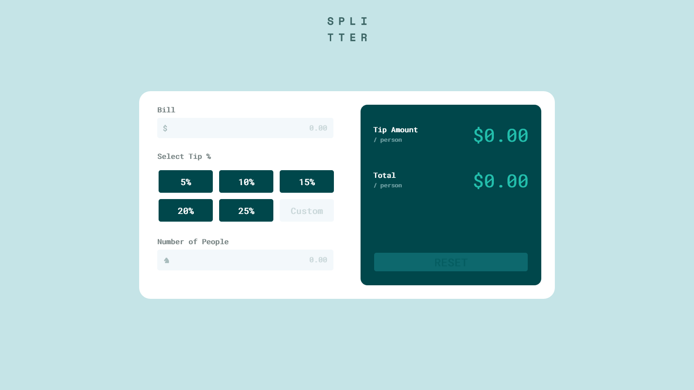

# Frontend Mentor - Tip calculator app solution

This is a solution to the [Tip calculator app challenge on Frontend Mentor](https://www.frontendmentor.io/challenges/tip-calculator-app-ugJNGbJUX). Frontend Mentor challenges help you improve your coding skills by building realistic projects.

## Table of contents

- [Overview](#overview)
  - [The challenge](#the-challenge)
  - [Screenshot](#screenshot)
  - [Links](#links)
- [My process](#my-process)
  - [Built with](#built-with)
  - [What I learned](#what-i-learned)
  - [Continued development](#continued-development)
- [Author](#author)

## Overview

### The challenge

Users should be able to:

- View the optimal layout for the app depending on their device's screen size
- See hover states for all interactive elements on the page
- Calculate the correct tip and total cost of the bill per person

### Screenshot

### Links

- Solution URL: [Add solution URL here](http://localhost:3000)

## My process

### Built with

- Semantic HTML5 markup
- CSS custom properties
- CSS Table
- Desktop-first workflow
- [JQuery](https://jquery.com/) - JS library

### What I learned

Refreshing HTML, CSS, JQuery skills

### Continued development

Focus on CSS-grids, responsivenes, use more bootstrap. MORE STRUCTURE.

## Author

- Niklas Grüner

